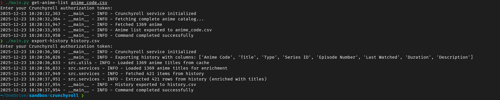
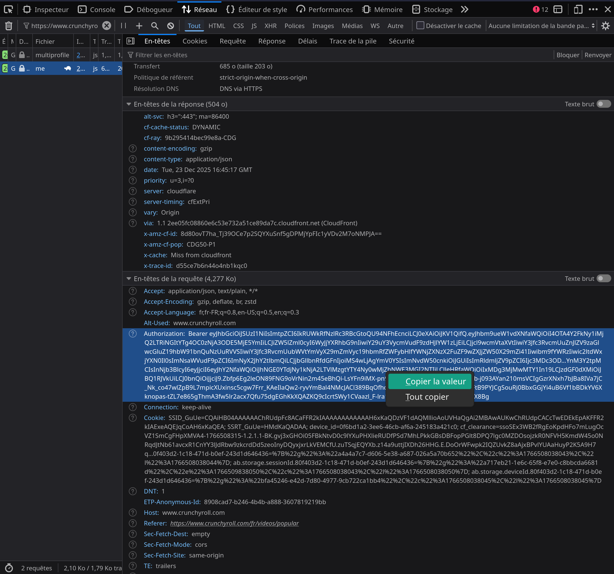
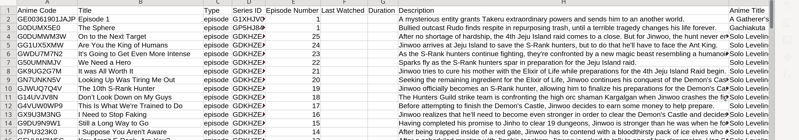

# Crunchyroll Data Exporter

A standalone Python CLI tool for exporting your Crunchyroll watchlist, watch history, and custom lists to CSV format.

## Overview

This tool allows you to export your Crunchyroll account data including:

- **Watchlist**: All anime you've added to watch later
- **Watch History**: Complete viewing history with timestamps
- **Custom Lists (Crunchylists)**: User-created anime collections
- **Anime Catalog**: Full Crunchyroll anime database with language information

All data is exported to CSV files for easy analysis, backup, or migration.



## Features

- 📥 **Export watchlist, history, and custom lists** to CSV
- 🎯 **Selective column export** - choose only the data you need
- 🌍 **Multi-language support** - automatic language code translation
- 📊 **Anime title enrichment** - automatically adds anime series names
- 🔒 **Secure authentication** - token stored in environment variables
- ⚡ **Fast and efficient** - optimized with caching mechanisms
- 📝 **CSV format** - compatible with Excel, Google Sheets, and data analysis tools

## Requirements

- Python 3.7 or higher
- pip (Python package manager)
- A Crunchyroll account with an active subscription
- Crunchyroll authorization token (see [Configuration](#configuration))

## Installation

### 1. Clone or Download

```bash
git clone https://github.com/MikaelPecyna/Crunchyroll-export
cd Crunchyroll-export/
```

### 2. Install Dependencies

```bash
pip install dotenv requests
```

### 3. Verify Installation

Run the validation script to check your setup:

```bash
python validate.py
```

Expected output:

```
✓ Python 3.x.x
✓ requests              HTTP requests library
✓ dotenv                Environment variable management
✓ All required files exist
Installation validated successfully!
```

## Configuration

### Getting Your Crunchyroll Token

1. Open your web browser and log in to [Crunchyroll](https://www.crunchyroll.com)
2. Open Developer Tools (F12 or Right Click → Inspect)
3. Go to the **Network** tab
4. Refresh the page and filter by "discover"
5. Click on any request and look at the **Request Headers**
6. Find the `Authorization` header - copy its full value
   - Format: `Bearer eyJ...` (starts with "Bearer")



### Setting Up Your Token

Create a `.env` file in the `python` directory:

```bash
# In the python directory
echo "CRUNCHYROLL_TOKEN=Bearer YOUR_TOKEN_HERE" > .env
```

Or manually create `.env`:

```
CRUNCHYROLL_TOKEN=Bearer eyJhbGciOiJSUzI1NiIsImtpZCI6ImQ4NW...
```

## Usage

```bash
# You need to generate your anime code (if some are missing from the one in anime_code.csv)
python main.py get-anime-list anime_code.csv
```

### Basic Commands

```bash
# Export watchlist
python main.py export-watchlist output.csv

# Export watch history
python main.py export-history history.csv

# Export custom lists
python main.py export-crunchylists lists.csv

# Export complete anime catalog
python main.py get-anime-list anime_catalog.csv

# Show all available columns
python main.py show-columns
```

### Advanced Usage

#### Custom Column Selection

Export only specific columns:

```bash
# Export watchlist with only title and series ID
python main.py export-watchlist output.csv --columns "Title,Series ID,Anime Title"

# Export history with minimal information
python main.py export-history history.csv --columns "Title,Last Watched,Anime Title"
```

#### Using Token from Command Line

Instead of `.env` file:

```bash
python main.py --token "Bearer YOUR_TOKEN" export-watchlist output.csv
```

### Available Columns

#### Watchlist Columns

- `Anime Code` - Unique episode identifier
- `Title` - Episode title
- `Type` - Content type (episode, movie)
- `Series ID` - Series identifier
- `Episode Number` - Episode number
- `Duration` - Episode duration in milliseconds
- `Rating` - Content rating
- `Description` - Episode description
- `Images` - Image URLs
- `Anime Title` - Series name (auto-added when `Series ID` is present)

#### History Columns

- `Anime Code` - Unique episode identifier
- `Title` - Episode title
- `Type` - Content type
- `Series ID` - Series identifier
- `Episode Number` - Episode number
- `Last Watched` - Timestamp of last viewing
- `Duration` - Episode duration
- `Description` - Episode description
- `Anime Title` - Series name (auto-added)

#### Crunchylist Columns

- `List Name` - Name of the custom list
- `Anime Code` - Unique identifier
- `Title` - Content title
- `Type` - Content type
- `Description` - Content description
- `Anime Title` - Series name (auto-added)

## Output Format

### CSV Structure

All exports generate CSV files with UTF-8 encoding, suitable for:

- Microsoft Excel
- Google Sheets
- LibreOffice Calc
- Data analysis (pandas, R, etc.)

### Example Output

```csv
Anime Code,Title,Type,Series ID,Episode Number,Anime Title
G0DUMWM3W,On to the Next Target,episode,GDKHZEJ0K,25,Solo Leveling
GG1UX5XMW,Are You the King of Humans,episode,GDKHZEJ0K,24,Solo Leveling
```



## Anime Title Enrichment

The tool automatically enriches exported data with anime series titles by:

1. Loading an `anime_code.csv` reference file (if available)
2. Mapping `Series ID` to anime titles
3. Adding an `Anime Title` column to exports

This feature adds context to episode-level data, making it easier to filter and analyze by series.

To generate the reference file:

```bash
python main.py get-anime-list anime_code.csv
```

Place this file in the current directory (`anime_code.csv`) for automatic enrichment.

## Troubleshooting

### Token Expired

If you get authentication errors:

1. Tokens expire after a few minutes
2. Get a fresh token from your browser (see [Configuration](#configuration))
3. Update your `.env` file

### Empty Exports

If exported CSVs are empty:

- Check your Crunchyroll account has data
- Verify token is correctly formatted with "Bearer " prefix
- Ensure you're using a Premium/subscription account

### Unicode/Encoding Issues

The tool uses UTF-8-sig encoding with automatic fallbacks. If you see garbled characters:

- Open CSVs with UTF-8 encoding in your editor
- Use Excel's "Import" feature instead of double-clicking
- Try Google Sheets which handles UTF-8 natively

## Original Project

This is a **Python rewrite** of the original [Crunchyroll Export/Import List](https://github.com/Vryntel/Crunchyroll-Export-Import-List) project.

### Credits

The original implementation by [Vryntel](https://github.com/Vryntel) was built using:

- Google Sheets
- Google Apps Script
- SpreadsheetApp API

This version replaces the cloud-based solution with a **standalone Python CLI** that:

- Runs locally without Google Sheets dependency
- Provides command-line interface for automation
- Offers the same export functionality (import features removed in this version)

**Thank you** to Vryntel for the original project and reverse-engineering the Crunchyroll API!

## Technical Details

### API Communication

This tool interacts with Crunchyroll's internal API endpoints:

- `/accounts/v1/me` - User account information
- `/content/v2/discover/{account_id}/watchlist` - Watchlist data
- `/content/v2/{account_id}/watch-history` - Watch history
- `/content/v2/{account_id}/custom-lists` - Custom lists
- `/content/v2/discover/browse` - Anime catalog

### Architecture

- **services.py**: API client with request handling and error management
- **utils.py**: Data extraction, JSON parsing, and caching utilities
- **config.py**: Column mappings and API configuration
- **main.py**: CLI interface using argparse

### Data Flow

1. User authentication via token
2. API requests to Crunchyroll services
3. JSON response parsing and transformation
4. Optional anime title enrichment from cache
5. CSV export with configurable columns

## Contributing

Contributions welcome! Please:

1. Fork the repository
2. Create a feature branch
3. Follow PEP 8 style guidelines
4. Add docstrings to new functions
5. Test thoroughly before submitting PR

## License

MIT License - see original project for details.

## Disclaimer

This tool is for personal use only. Respect Crunchyroll's Terms of Service. The authors are not responsible for any misuse or violations.

---

**Questions or Issues?** Open an issue on the GitHub repository.
